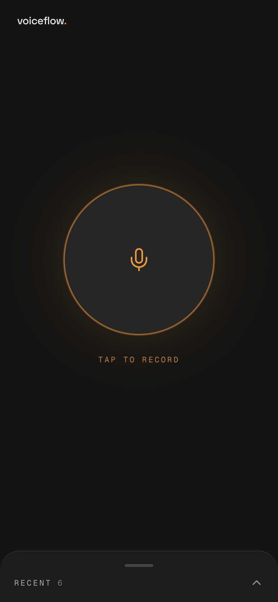
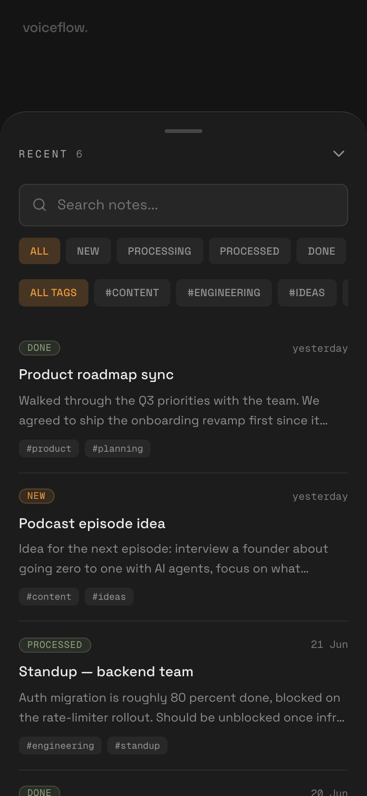
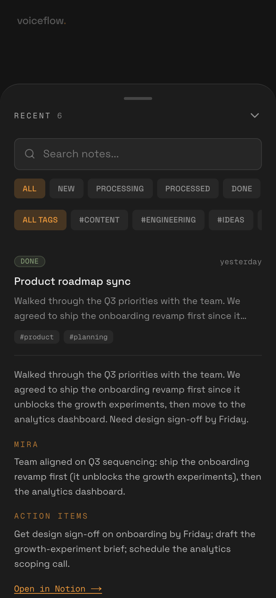
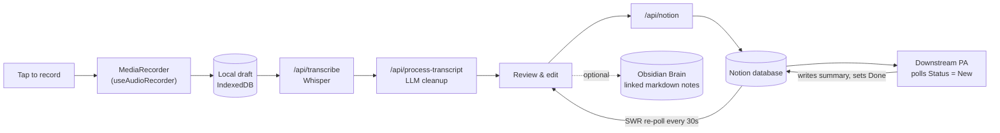

<div align="center">

# VoiceFlow

### Tap, talk, done — your voice, structured into Notion and ready for your Brain.

A voice-first Progressive Web App that turns spoken thoughts into clean, structured notes.
Record on your phone, let Whisper transcribe and an LLM tidy it into a summary with
action items, then sync it straight to Notion. The same capture pipeline can also hand
notes into an Obsidian Brain, arranging thoughts into linked notes, tasks, references,
and resurfaced ideas — all from a single, native-feeling screen.

[](https://nextjs.org/)
[](https://react.dev/)
[](https://www.typescriptlang.org/)
[](https://tailwindcss.com/)
[](#progressive-web-app)
[](LICENSE)

<br/>


&nbsp;&nbsp;

&nbsp;&nbsp;


</div>

---

## Overview

Capturing a thought on the move usually means stopping to type. **VoiceFlow** removes that
friction: open the app, tap once, talk. The recording is saved locally first (so nothing is
ever lost), transcribed with **OpenAI Whisper**, cleaned up by an LLM into a title, summary,
action items and tags, and then synced to a **Notion** database where it becomes part of an
automated workflow. It is designed so Obsidian can be added as a second destination:
voice notes can become linked markdown notes, tasks, project references, and durable
thought trails in your personal Brain.

The UI is deliberately built to feel like a *real* app, not a web page: one locked screen with
the record button as the hero and a pull-up sheet for history — no page scroll, safe-area aware,
installable to the home screen.

## Features

- 🎙️ **One-tap capture** — record, pause/resume, with a live waveform and a wake-lock so the screen stays on.
- 📴 **Offline-first** — every recording is persisted to IndexedDB *before* any network call, so a failed transcription never loses your audio.
- ✍️ **Whisper transcription** — audio is sent to OpenAI Whisper for accurate speech-to-text.
- 🤖 **AI cleanup** — an LLM pass turns the raw transcript into a title, summary, action items, decisions and follow-ups.
- 🗂️ **Notion sync** — reviewed notes are written to a Notion database with status, tags and duration; the app re-polls to reflect downstream processing.
- 🧠 **Obsidian Brain-ready** — the capture model can route cleaned notes into an Obsidian vault to arrange thoughts, link related ideas, and surface tasks later.
- 📱 **Installable PWA** — single-screen app shell, pull-up notes sheet, hand-authored service worker, add-to-home-screen.
- 🔁 **Queue contract** — notes land as `Status = New` for a downstream personal-assistant agent to pick up FIFO, process, and mark `Done`.

## How it works



1. **Record** → audio is captured and immediately saved as a local draft (IndexedDB).
2. **Transcribe** → `/api/transcribe` streams the audio to Whisper.
3. **Process** → `/api/process-transcript` runs an LLM pass for a clean title, summary, action items and tags.
4. **Review** → you confirm/edit in a bottom-sheet editor.
5. **Sync** → `/api/notion` creates the Notion page (transcript as the body, metadata as properties).
6. **Brain hand-off** → the same reviewed artifact can be routed into Obsidian as linked markdown for thoughts, tasks, projects and resurfacing.
7. **Assistant hand-off** → a downstream assistant reads `Status = New` notes, processes them, and writes results back — the app reflects status changes on its next poll.

## Tech stack

| Area | Choices |
|------|---------|
| Framework | Next.js 16 (App Router), React 19, TypeScript |
| Styling | Tailwind CSS v4, Framer Motion |
| AI | OpenAI Whisper (speech-to-text) + LLM transcript cleanup |
| Data | Notion SDK v5 (`dataSources` API), SWR; Obsidian Brain-ready markdown hand-off |
| Offline | IndexedDB local drafts, hand-authored service worker, Wake Lock API |

## Engineering highlights

- **Offline-first capture** — recordings persist locally before any request; transcription/sync are recoverable, retryable steps over that durable draft.
- **Single-screen app shell** — `100dvh`, no page scroll, safe-area insets, and a drag/tap bottom sheet for history (Framer Motion).
- **Lazy client initialisation** — OpenAI and Notion clients are instantiated per-request, so the app builds without secrets present.
- **Notion SDK v5** — uses the newer `dataSources.query` API (the old `databases.query` is gone).
- **Hand-authored service worker** — PWA install + caching without a plugin, for full control over the App Router.

## Screenshots & demo

| Record | Notes | AI summary |
|:---:|:---:|:---:|
|  |  |  |

<!-- TODO: drop in your screen-recording (e.g. docs/assets/demo.mp4 or a GIF) and the Notion screenshot here -->
<!--
**Demo video:** _add `docs/assets/demo.gif` and reference it here_
**Notion side:** _add `docs/assets/notion.png` showing the synced database_
-->

> _Demo video and a Notion view of the synced database are on the way._

## Getting started

**Prerequisites:** Node 18+, an OpenAI API key, and a Notion integration + database.

```bash
git clone https://github.com/mirasolutions06/voiceflow.git
cd voiceflow
npm install
cp .env.example .env.local   # then fill in the values
npm run dev                  # http://localhost:3000
```

### Notion setup

1. Create an integration at <https://notion.so/my-integrations> (grant **Read** + **Insert** content).
2. Create a database with these properties: `Name` (title), `Status` (select: New/Processing/Processed/Done/Archived), `RecordedAt` (date), `Tags` (multi-select), `Duration` (number), `MiraOutput` (rich text), `ActionItems` (rich text), `ProcessedAt` (date).
3. Share the database with your integration, then copy its ID into `NOTION_DATABASE_ID`.

> Mobile recording needs HTTPS — test via a tunnel (e.g. ngrok) or a deployment.

## Project structure

```
src/
├─ app/
│  ├─ page.tsx              # single-screen shell
│  ├─ api/transcribe        # Whisper
│  ├─ api/process-transcript# LLM cleanup
│  └─ api/notion            # save to Notion
├─ components/              # VoiceRecorder, BottomSheet, NoteCard, TranscriptEditor …
├─ hooks/                  # useAudioRecorder, useNotes, useLocalDrafts, useWaveform
└─ lib/                    # openai, notion, localDrafts, transcriptionClient
```

## License

[MIT](LICENSE)

### Obsidian Brain path

Obsidian does not need to replace Notion. It can sit beside it as the long-term thinking
layer: VoiceFlow captures the raw thought, the LLM cleans it, and an Obsidian adapter can
write markdown notes with backlinks, tags, tasks, project links, and resurfacing metadata.
That turns fast voice capture into an arranged personal knowledge base instead of a pile
of transcripts.

## Author

**Mira Solutions** · [@mirasolutions06](https://github.com/mirasolutions06)
